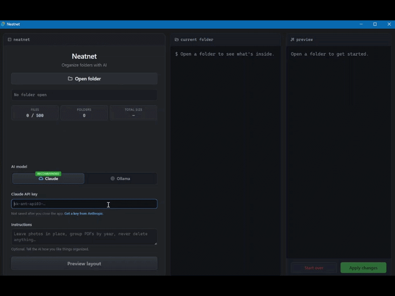

# Neatnet

**Organize folders with AI** — a desktop app that proposes how to organize a folder, lets you review and edit the plan, and applies the changes.

> v0.1 — Always review the preview before applying.

## How it works

1. **Open folder** — pick a folder on your machine (Neatnet scans up to 500 files; skips `node_modules`, `.git`, and similar).
2. **Preview layout** — Claude (cloud) or Ollama (local) proposes **moves** into folders and optional **deletes**. Filenames stay the same.
3. **Review** — drag files between folders in the preview tree; turn individual deletes on or off.
4. **Apply** — confirm once; only then are files moved or deleted on disk.

## Features

- **Claude or Ollama** — cloud (API key per session) or fully local
- **Preview-first** — edit the plan before anything runs on disk
- **Drag-and-drop preview** — adjust folder layout without re-running the model

## Limits (v0.1)

- Up to **500 files** per folder (organize is disabled if the scan hits the cap)
- **Windows, macOS, and Linux** (desktop app via Tauri)

## Getting started

1. Install and run Neatnet (see your repo or release notes for build steps).
2. Set up **either**:
   - [Ollama](https://ollama.com/) with a model, e.g. `ollama pull llama3.1:8b`, **or**
   - a [Claude API key](https://console.anthropic.com/settings/keys) in the app (not saved after you quit).
3. **Open folder** → optional **Instructions** → choose **Claude** or **Ollama** → **Preview layout** → review → **Apply changes**.

## License

MIT — see [LICENSE](LICENSE).
